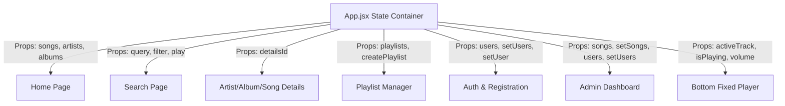

# 🎵 Sound-Stream: Premium Music Streaming Platform

Sound-Stream is a state-of-the-art, Spotify-inspired web application built with **React 19**, **Vite**, and **Vanilla CSS**. It provides a fully functional, self-managed music library experience featuring a gorgeous glassmorphic UI, responsive layouts, audio playback control, playlist curation, and an advanced administrative dashboard with real-time CRUD controls.


---
| 🌐 **Site en ligne (démo)** | [Cliquez ici](https://sound-stream-ten.vercel.app/) |
## ✨ Features

### 🎧 Audio Playback & Player
*   **Persistent Bottom Player:** Seamless audio controls, including Play/Pause, Next, Previous, and Volume sliders.
*   **Playback Queue:** Tracks dynamically loop and support smart **Shuffle** and index-based queue traversal.
*   **Favorites & Likes:** Direct integration with the user's favorite tracklist, easily toggled from the player bar or details pages.
*   **Interactive Progress Seeking:** Visual playback track details and duration indicators.

### 📊 Admin Control Center (Dashboard)
*   **Listening Analytics:** A custom SVG line chart displaying real-time stream data (thousands) across months with interactive hovering.
*   **Catalog CRUD Panels:** Dedicated control panels to **Create, Read, Update, and Delete** models for:
    *   **Songs:** Upload local files (audio & cover art) using native `Blob` URLs for instantly playable items.
    *   **Artists:** Manage verification badges, banner URLs, biographic summaries, and genres.
    *   **Albums:** Group songs together by artist, year of release, genre, and descriptions.
    *   **Users:** System role modifications (toggle Standard/Admin privileges), email updates, and metrics.

### 🔍 Discovery & Personalization
*   **State-Driven Router:** Instant transition between pages without page reloads (Home, Search, Details, Playlists, Auth, Profile, Admin).
*   **Real-time Unified Search:** Filter dynamically by song names, artist profiles, or album titles with a single search bar.
*   **Dynamic Custom Playlists:** Users can instantiate custom playlists, append song tracks, and edit queue contents.
*   **User Profiles:** Individualized metrics dashboard displaying total listening hours, favorite genres, curated playlists, and favorited songs.

---

## 🎨 Design System & Aesthetics

Sound-Stream implements a bespoke design system via **pure Vanilla CSS** using custom properties, glassmorphism elements, and smooth hardware-accelerated transitions:

*   **Color Palette:** Sleek dark-mode aesthetic utilizing deep space colors (`#05060b`, `#0a0b12`) highlighted with vibrant accent gradients (`#7b2cbf` to `#00b4d8`).
*   **Typography:** Modern typography imports utilizing **Outfit** and **Plus Jakarta Sans** for clean, readable headers and details.
*   **Glassmorphic Design:** Card containers, modals, sidebars, and nav elements render with `backdrop-filter: blur()` overlays and subtle semi-transparent borders.
*   **Mobile-First Responsiveness:**
    *   *Desktops:* Fixed left sidebar with quick links and custom playlist creator.
    *   *Tablets (under 1024px):* Collapse sidebar to mini icon-only layout to maximize screen estate.
    *   *Mobile (under 768px):* Automatically transforms into a bottom tab bar navigation and simplifies player controls.

---

## 🛠️ Technology Stack

*   **Framework:** [React 19](https://react.dev/) (Functional components, Hooks, and State Management)
*   **Build Tool:** [Vite](https://vitejs.dev/) (Ultra-fast development server and asset bundling)
*   **Iconography:** [Lucide React](https://lucide.dev/) (Crisp SVG vector icons)
*   **Linter:** [Oxlint](https://oxc.rs/docs/guide/usage/linter.html) (Extremely fast Rust-based linter)
*   **Styling:** Native CSS custom properties and keyframe animations.

---

## 📐 Application Architecture & Data Flow

Sound-Stream uses central state propagation at the top-level `App` component. This architecture serves as an in-memory client-side database, ensuring that any modifications (CRUD) applied by administrative users instantly updates references across all views without refreshing.



---

## 🚀 Getting Started

### 📋 Prerequisites
Make sure you have [Node.js](https://nodejs.org/) installed on your machine (v18+ recommended).

### ⚙️ Installation
1. Clone the repository or navigate to the project directory:
   ```bash
   cd music
   ```
2. Install the package dependencies:
   ```bash
   npm install
   ```

### 💻 Running the Application
*   **Start Development Server:** Runs the app in development mode with Hot Module Replacement (HMR).
    ```bash
    npm run dev
    ```
    Once started, navigate to the local address displayed in the console (usually `http://localhost:5173`).

*   **Linting the Codebase:** Run the Oxlint linter to detect issues:
    ```bash
    npm run lint
    ```

*   **Production Build:** Compile the application and prepare assets for hosting:
    ```bash
    npm run build
    ```

*   **Preview Production Build:** Run a local server to test the compiled production bundles:
    ```bash
    npm run preview
    ```

---

## 📂 Project Structure

```text
music/
├── public/                 # Static assets
├── src/
│   ├── assets/             # Images, SVGs, and media files
│   ├── components/         # Reusable structural components
│   │   ├── Navbar.jsx      # Top navigation & live search input
│   │   ├── Player.jsx      # Bottom fixed audio media player
│   │   └── Sidebar.jsx     # Navigation sidebar (responsive)
│   ├── data/
│   │   └── mockData.js     # Default mock templates & system users
│   ├── pages/              # Routing panels / Views
│   │   ├── AdminDashboard.jsx # CRUD tables & analytics
│   │   ├── Auth.jsx        # Login & user registration page
│   │   ├── Details.jsx     # Details for albums, songs, & artists
│   │   ├── Home.jsx        # Dashboard highlights
│   │   ├── PlaylistPage.jsx# Custom user-curated tracks
│   │   ├── Profile.jsx     # User metadata & stats
│   │   └── Search.jsx      # Live catalog search view
│   ├── App.css             # Root structure variables
│   ├── App.jsx             # Main router & database states
│   ├── index.css           # Global typography, glassmorphism, & breakpoints
│   └── main.jsx            # React root DOM instantiation
├── vite.config.js          # Vite build config
├── package.json            # Scripts & dependencies
└── README.md               # Documentation
```

---

> By default, the application pre-authenticates you as **Alex Mercer** (Admin role) upon launch. This allows you to explore the **Admin Dashboard** and edit catalog listings immediately. You can log out from the sidebar to register a standard user account.
